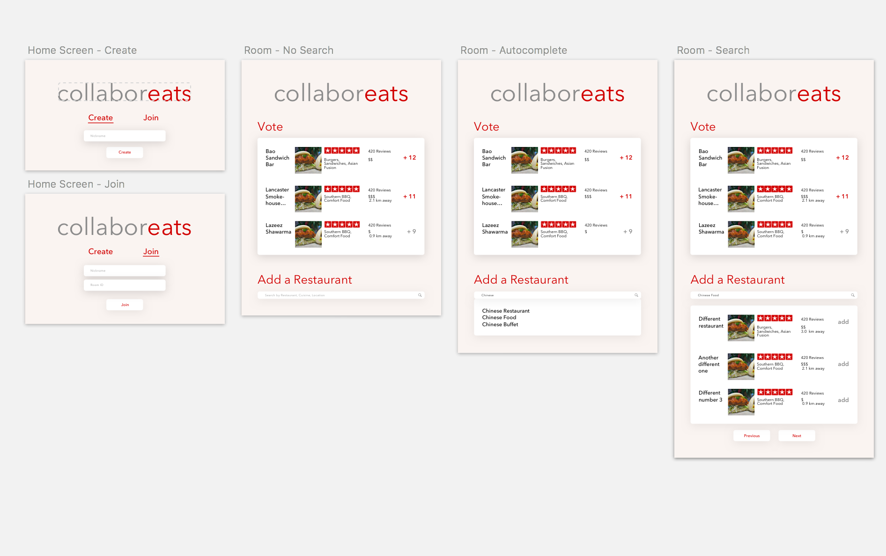
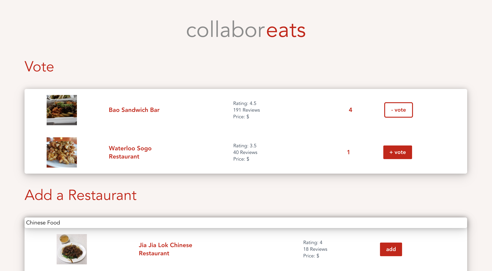

# collaboreats

###### Built by Patrick Liu, Paul Janiszewski, and Vivien Ding for EngHack S18

---

After countless hours of arguing about food preferences just to pick dinner at a place that is poorly researched and expensive, we have finally had enough.

### What it does
collaboreats is a chat room that makes group decisions easier, more intuitive, and most importantly, without argument. A user can create a chat room, where they can send their friends a generated code. Friends who join the room via the code will be linked into one common channel. In this channel, users will see a list of restaurants and will be able to vote on their preferences. Additionally, they can search for and add their own favourite restaurants. Users will be able see reviews, price, amongst other deciding factors.

### How we built it
Users can create a chatroom through a user ID and we generated a random code through our back-end with Express. We stored these in a MongoDB database, where user IDs were added when they joined with the code. We ensured that users could not add twice this way, by checking votes against IDs. For a user to add a dining option, our team found a way to leverage Yelp APIs to search and retrieve names, images, rating, and a variety of other data and surfaced this throughout our app.

### Challenges we ran into
Not all of us were super experienced with JavaScript, so developing with a pure JS stack had its moments of difficulty. We picked an ambitious project where all of our members were very busy from beginning to end, but we ended up surpassing our own expectations!

### Accomplishments that we're proud of
We're super proud to have implemented most of our planned features despite only having roughly 20 hours for hacking. Designing our UI from scratch was also a point of pride, as well as our backend architecture that was very very extensive.

### What we learned
Lots of JavaScript, not to give up hope, and that web development can be pretty exciting.

### What's next for collaboreats
Sockets for real-time updates. More Yelp information. Veto options. Auto-complete.

#### Images




### Technologies used
 - Node.js
 - Express.js
 - Vue.js
 - MongoDB
 - Yelp API
 - Sketch

### License
```
MIT License

Copyright (c) 2018 Patrick Liu

Permission is hereby granted, free of charge, to any person obtaining a copy
of this software and associated documentation files (the "Software"), to deal
in the Software without restriction, including without limitation the rights
to use, copy, modify, merge, publish, distribute, sublicense, and/or sell
copies of the Software, and to permit persons to whom the Software is
furnished to do so, subject to the following conditions:

The above copyright notice and this permission notice shall be included in all
copies or substantial portions of the Software.

THE SOFTWARE IS PROVIDED "AS IS", WITHOUT WARRANTY OF ANY KIND, EXPRESS OR
IMPLIED, INCLUDING BUT NOT LIMITED TO THE WARRANTIES OF MERCHANTABILITY,
FITNESS FOR A PARTICULAR PURPOSE AND NONINFRINGEMENT. IN NO EVENT SHALL THE
AUTHORS OR COPYRIGHT HOLDERS BE LIABLE FOR ANY CLAIM, DAMAGES OR OTHER
LIABILITY, WHETHER IN AN ACTION OF CONTRACT, TORT OR OTHERWISE, ARISING FROM,
OUT OF OR IN CONNECTION WITH THE SOFTWARE OR THE USE OR OTHER DEALINGS IN THE
SOFTWARE.
```